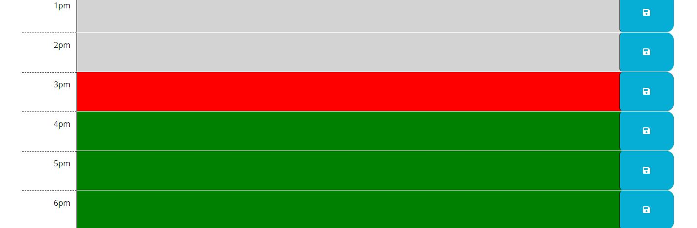

# Planner Application
A calendar application that allows a user to save events for each hour of the day.

## Description
This webpage contains a planner application. The aim was to create a planner application which stores user input to loca storage and informs the user of the current time based on a colour scheme with grey meaning the time has passed, red being the current time and green being the time left for the day. Throughout this project, I have developed an understanding of local storage and how dayjs can be used. I also developed my knowledge and understanidng of how to use bootstrap to format a web application. 

## Installation

To work on this code copy this SSH key: git@github.com:chelsea32568/planner-app.git and paste into your desired folder using Git Bash. Then use git pull to pull the file into your local repository. Make necessary changes and then add changes into the git repository by using git add -A, git commit -m "", git push.

## Usage

After opening the HTML file the Planner Application appears.

The colours indicate the time for the user

Users can log information and press save to save the text to local storage. This is then retreived even if the application is closed and reopened. 

The top of the planner application is updated with the current day and date using day js.

## Credits

 how to change the color with the time

- [How to find the hour on dayjs](https://day.js.org/docs/en/get-set/get-set)

- [How to change the colour based on the current time](https://stackoverflow.com/questions/59995703/trying-to-change-background-color-based-off-if-the-hour-is-in-the-past-current)

- [Save text to loca storage] Sean New - Online Tutoring Service

- [Help with the page layout] https://github.com/jtbataille/Day-to-Day-Planner.git

## License

MIT License

Copyright (c) [2023] [Chelsea Chapman]

Permission is hereby granted, free of charge, to any person obtaining a copy
of this software and associated documentation files (the "Software"), to deal
in the Software without restriction, including without limitation the rights
to use, copy, modify, merge, publish, distribute, sublicense, and/or sell
copies of the Software, and to permit persons to whom the Software is
furnished to do so, subject to the following conditions:

The above copyright notice and this permission notice shall be included in all
copies or substantial portions of the Software.

THE SOFTWARE IS PROVIDED "AS IS", WITHOUT WARRANTY OF ANY KIND, EXPRESS OR
IMPLIED, INCLUDING BUT NOT LIMITED TO THE WARRANTIES OF MERCHANTABILITY,
FITNESS FOR A PARTICULAR PURPOSE AND NONINFRINGEMENT. IN NO EVENT SHALL THE
AUTHORS OR COPYRIGHT HOLDERS BE LIABLE FOR ANY CLAIM, DAMAGES OR OTHER
LIABILITY, WHETHER IN AN ACTION OF CONTRACT, TORT OR OTHERWISE, ARISING FROM,
OUT OF OR IN CONNECTION WITH THE SOFTWARE OR THE USE OR OTHER DEALINGS IN THE
SOFTWARE.

© 2023 edX Boot Camps LLC. Confidential and Proprietary. All Rights Reserved.
